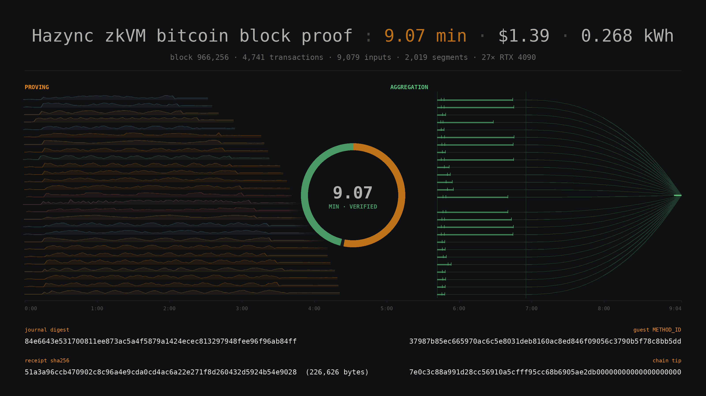

# A clean 9-minute block proof, with a receipt on disk — block 966,256, run 4

Block **966,256** — 4,741 transactions, 9,079 inputs — was proved end to end in **544.0 seconds
(9.07 minutes)** across **27 rented RTX 4090s** in six countries. **No stalls, no reassignments,
no restarts, no #119 faults.** GPU cost: **$1.387**.

```
### CONTINUOUS BLOCK PROOF: 544.0s = 9.07 min
### block 966,256 | 4,741 txs | 9,079 inputs | 27x RTX 4090
### cost $1.387
>>> PUSH-TRANSPORT RECEIPT VERIFIED against METHOD_ID
    digest 84e6643e531700811ee873ac5a4f5879a1424ecec813297948fee96f96ab84ff
```

This is the fourth 966,256 run and the first one that is clean in every sense: nothing intervened
during it, and **it ends with a receipt file** rather than a digest in a log.



*One row per card, on a single 0→9:04 axis: GPU power in its site colour while it proves its chunk,
then that card's aggregate work in green. After assembly begins the rows converge — the join tree
folding every worker's work into one receipt. Drawn entirely from 1 Hz telemetry and the workers'
own logs; an animated version is
[attached to the v0.21.0 release](https://github.com/bitcoin-ghost/hazync/releases/download/v0.21.0/run4-min.gif)
and at `docs/assets/block-966256-run4.gif`.*

---

## The receipt exists

The first three runs of this block each verified and then lost the artifact — `seg-serve` (published
v0.21.0) verifies the aggregate in process, prints its digest and exits without an `fs::write`. The
fix is `4cad145`, which is in source but not in the released binary, so the receipt here was rebuilt
from the 27 chunk receipts with `agg-chunks`:

```
>>> BLOCK 966256 AGGREGATED in 1562.0s — succinct receipt VERIFIED, saved block_966256.receipt
    tip_hash  7e0c3c88a991d28cc56910a5cfff95cc68b6905ae2db00000000000000000000
    cum_work  547405326421326969430430          UTXO leaves 5758
```

**`block_966256_run4.receipt` — 226,626 bytes, sha256
`51a3a96ccb470902c8c96a4e9cda0cd4ac6a22e271f8d260432d5924b54e9028`.**

Re-verified afterwards on a machine that took no part in the run:

```
$ hazync-host-cuda receipt-digest block_966256_run4.receipt
VERIFIED against METHOD_ID
journal_bytes  1700
journal_digest 84e6643e531700811ee873ac5a4f5879a1424ecec813297948fee96f96ab84ff
```

### Two receipts, different bytes, identical journal

Run 3's receipt was regenerated the same way and is a **different file** —
sha256 `8eb3377ac7a986be73326ee8be7cc6372361580e9f01f5c05ad956a24698ea5b`, same 226,626 bytes — yet
carries the **identical** `journal_digest`. That is the expected result and it is worth stating
plainly, because comparing receipt SHAs has misled this project before: risc0 draws a fresh random
field element per segment in `preflight()`, so seal bytes are never reproducible. The **journal** is
a function of the block. Two independently produced receipts agreeing on it is the meaningful check;
their SHAs disagreeing is not a defect.

Across everything run against this block — five fleet aggregates at 19, 21, 22, 26 and 27 workers,
plus three solo `agg-chunks` rebuilds — the digest `84e6643e5317…` has never differed.

---

## Phase breakdown

| phase | at | duration |
|---|---:|---:|
| T0 (fleet verified empty, clock starts) | 0.0 s | |
| 27 proves launched | +40.0 s | 40.0 s |
| chunk phase complete (all 27) | +287.9 s | 247.9 s |
| 27 receipts staged on the coordinator | +293.7 s | 5.8 s |
| aggregate listener open, workers attached | +333.7 s | 40.0 s |
| **VERIFIED** | **+544.0 s** | 210.3 s |

The aggregate's own accounting:

```
execution     38.9 s   585 segments, 299.4 MB, depth 4
worker wall   73.6 s   584 segments pushed over the network
assembly     128.7 s   last segment + join tree + resolves
TOTAL        241.2 s
```

**The aggregate is now the larger half of the run** — 241.2 s against 247.9 s of chunk proving, on
27 cards. Its assembly phase (128.7 s) is the join tree, which saturates around N=2 and does not care
how many cards are attached. Adding cards shortens the chunk phase and leaves this untouched, so a
sub-8-minute proof of this block needs the aggregate attacked, not more GPUs.

---

## The fleet

27× RTX 4090, six countries, twelve distinct host CPUs (AMD EPYC 7452/7502/7532/7542/7543/7642/7763/
75F3/7F72/7K62, Intel Xeon Platinum 8352V, Intel i5-13600K):

| site | cards |
|---|---:|
| United States | 11 |
| Canada | 7 |
| Iceland | 5 |
| Taiwan | 2 |
| Norway | 1 |
| France | 1 |

Every card peaked at ~22.4 GB VRAM — the same ~22 GB working set noted in
`gotcha_cuda_oom_is_build_dependent`, which is why two proves must never share a card.

| chunk | site | inputs | segs | wall s | s/seg | peak VRAM | peak W | peak °C | start +s | end +s |
|---:|:--|---:|---:|---:|---:|---:|---:|---:|---:|---:|
| 6 | IS | 213 | 52 | 153.3 | 2.95 | 22,452 MiB | 282 | 54 | -1.1 | 152.1 |
| 7 | IS | 213 | 52 | 157.9 | 3.04 | 22,470 MiB | 284 | 51 | -1.2 | 156.8 |
| 8 | CA | 213 | 52 | 161.0 | 3.10 | 22,360 MiB | 276 | 57 | -0.5 | 160.6 |
| 0 | CA | 339 | 83 | 174.5 | 2.10 | 22,460 MiB | 322 | 85 | -0.7 | 173.8 |
| 18 | IS | 254 | 57 | 176.9 | 3.10 | 22,476 MiB | 259 | 47 | -1.1 | 175.7 |
| 2 | US | 233 | 77 | 197.5 | 2.56 | 22,458 MiB | 289 | 60 | -0.7 | 196.9 |
| 5 | CA | 277 | 68 | 199.9 | 2.94 | 22,472 MiB | 287 | 57 | -0.5 | 199.3 |
| 19 | US | 282 | 66 | 202.9 | 3.07 | 22,478 MiB | 270 | 67 | -0.3 | 202.6 |
| 9 | NO | 264 | 69 | 205.7 | 2.98 | 22,470 MiB | 282 | 54 | -1.3 | 204.5 |
| 17 | US | 280 | 66 | 213.7 | 3.24 | 22,468 MiB | 283 | 71 | -0.2 | 213.5 |
| 20 | US | 305 | 71 | 215.3 | 3.03 | 22,430 MiB | 283 | 72 | -0.3 | 215.1 |
| 10 | US | 282 | 73 | 218.3 | 2.99 | 22,476 MiB | 282 | 73 | -0.2 | 218.1 |
| 3 | TW | 340 | 84 | 221.3 | 2.63 | 22,454 MiB | 284 | 72 | 1.2 | 222.5 |
| 16 | US | 316 | 74 | 221.9 | 3.00 | 22,442 MiB | 283 | 80 | -0.3 | 221.6 |
| 4 | TW | 357 | 85 | 232.8 | 2.74 | 22,448 MiB | 281 | 59 | 1.2 | 233.9 |
| 26 | FR | 1007 | 85 | 233.2 | 2.74 | 22,432 MiB | 328 | 59 | -1.3 | 231.9 |
| 1 | CA* | 353 | 81 | 236.8 | 2.92 | 22,468 MiB | 291 | 61 | -0.6 | 236.2 |
| 11 | IS | 248 | 81 | 246.8 | 3.05 | 22,470 MiB | 284 | 54 | -1.1 | 245.7 |
| 24 | IS | 359 | 85 | 249.2 | 2.93 | 22,466 MiB | 273 | 60 | -1.0 | 248.2 |
| 23 | CA | 411 | 84 | 249.6 | 2.97 | 22,472 MiB | 272 | 60 | -0.3 | 249.3 |
| 22 | US | 473 | 81 | 251.5 | 3.10 | 22,442 MiB | 278 | 78 | -0.3 | 251.2 |
| 15 | US | 314 | 77 | 251.7 | 3.27 | 22,476 MiB | 274 | 75 | -0.2 | 251.5 |
| 14 | US | 304 | 82 | 255.6 | 3.12 | 22,466 MiB | 307 | 84 | -0.3 | 255.3 |
| 21 | CA | 345 | 83 | 259.0 | 3.12 | 22,460 MiB | 272 | 60 | -0.1 | 259.0 |
| 12 | US | 353 | 84 | 260.0 | 3.10 | 22,476 MiB | 288 | 85 | -0.1 | 259.9 |
| 13 | US | 322 | 82 | 262.2 | 3.20 | 22,476 MiB | 283 | 72 | -0.3 | 261.9 |
| 25 | CA | 422 | 85 | 263.3 | 3.10 | 22,460 MiB | 268 | 60 | -0.3 | 263.0 |

`CA*` is the spare swapped in for chunk 1 after that slot's Taiwan card died mid-prove in two
earlier attempts. Chunk 26 is the coordinator, which proves a chunk *and* runs the aggregate; its
1,007 inputs are the coinbase-heavy tail.

**Straggler ratio 1.191** (slowest chunk / mean). Chunk wall times: min 153.3 s, median 221.9 s,
mean 221.2 s, max 263.3 s. 2,019 segments proved, **`rc=0` on all 27**, **zero #119 retries**.

Per-card 1 Hz telemetry (utilisation, VRAM, temperature, power, SM/memory clocks) is in
`cards/chunk_N/gpu_samples.csv`; `summary.csv` carries the table above with host CPU and RAM.

---

## What made this run clean

Runs 1–3 were all degraded by the orchestrator, not by the hardware, and every one of its bugs
produced a plausible wrong answer rather than an error. They are worth recording because they are
all the same mistake in different clothes — **inferring a fact instead of observing it.**

| bug | what it did |
|---|---|
| stall probe written in double quotes | `$(grep …)`/`$(stat …)` expanded on the *operator's laptop*, not the pod. The probe returned a constant, so every healthy card looked frozen and was killed at exactly the grace limit |
| stall inferred from log growth | the execute phase is CPU-only and silent for minutes; the first segment adds CUDA context creation and kernel JIT. Healthy cards were shot mid-work in three separate runs |
| `pgrep -cf seg-serve` | the remote shell's own command line contains the string, so it counts itself — a dead aggregate always reads as alive |
| `ps -eo comm \| grep "^hazync-host-cuda$"` | `comm` truncates at 15 characters, so this matches **nothing** — a live aggregate reads as dead. Acting on it relaunched `seg-serve` on top of a working one, which died on `bind()` while the original kept going with its log already unlinked |
| `rm -f agg.log` on a running aggregate | the live process kept writing to the deleted inode; when it exited, run 3's verified digest went with it |
| reassign on "receipt exists" | `chunk_N.bin` appears before the process releases ~22 GB of VRAM, so the new prove landed on a card still holding it → hazync#97 |

The stall detector no longer infers anything. It kills only on a **direct death signal** — no prove
process, or GPU utilisation under 5% *with* VRAM released — which cannot fire on a card that is
working. In run 4 it fired zero times.

The remaining fault was hardware: one Taiwan card died mid-prove (`gpu=0%`, `vram=1 MiB`, process
gone) in two consecutive attempts. It was swapped for a spare and run 4 ran without incident.

---

## The four runs, honestly

| run | wall | cards | note |
|---|---:|---:|---|
| 1 | 485.2 s (8.09 min) | 26 | fastest; receipt not persisted at the time |
| 2 | 538.0 s (8.97 min) | 27 | receipt regenerated, `a024158a…` |
| 3 | ~15 min | 27 | dead card **and** orchestrator faults; **not a result** |
| **4** | **544.0 s (9.07 min)** | **27** | **clean, no interventions, receipt `51a3a96c…`** |

Run 3 is listed to be counted, not to be cited. Its chunk phase was sound — 26 of 27 chunks finished
by +4:20 — but a dead card and two orchestrator mistakes put its wall clock past 15 minutes, and its
aggregate digest was destroyed by the `rm -f agg.log` above. Its receipt was rebuilt afterwards from
its 27 chunk receipts and verifies; the wall clock is what is void.

Run 1 remains the fastest number. **Run 4 is the one to cite**, because it is the only one where the
figure, the conditions and the artifact all hold together at once.

⚠ **The 9.07 minutes is attested, not proved.** It rests on logs and 1 Hz telemetry. Nothing about a
wall clock is cryptographic, and putting one next to a digest does not make it so. What is
cryptographic is the receipt, and it is now on disk.

---

## Cost

| | |
|---|---:|
| GPU-seconds | 27 cards × 544.0 s = 14,688 GPU-s |
| rate | ~$0.34/hr per RTX 4090 |
| **the proof itself** | **$1.387** |
| receipt regeneration (`agg-chunks`, 1 card, 1,562 s) | $0.15 |
| the whole night (screening 29 pods, four runs, aggregates, rebuilds) | **$95.34** |

The proof costs about **$1.39**. Everything else was the cost of learning to run it — most of it
mine, spent on bugs listed above.

---

## Reproducing it

```sh
curl -fLO https://bitcoinghost.org/hazync/repro/block_966256.json.gz && gunzip block_966256.json.gz
sha256sum block_966256.json   # 41271d4f6ffd7048dc01caef62c5f1d223e34dd8737f8975d9c8927220d953a2

curl -fLO https://github.com/bitcoin-ghost/hazync/releases/download/v0.21.0/hazync-host-x86_64-linux-gnu-cuda
chmod +x hazync-host-x86_64-linux-gnu-cuda
./hazync-host-x86_64-linux-gnu-cuda method-id   # expect 37987b85…

# verify the published receipt without proving anything:
./hazync-host-x86_64-linux-gnu-cuda receipt-digest block_966256_run4.receipt
#   VERIFIED against METHOD_ID
#   journal_digest 84e6643e531700811ee873ac5a4f5879a1424ecec813297948fee96f96ab84ff

# or rebuild it from the 27 chunk receipts (~26 min on one 4090):
HAZYNC_LIFTX_HINT=1 HAZYNC_FIELD_BIGINT2=1 HAZYNC_ECMULT_WINDOW=21 \
HAZYNC_BLOCK=block_966256.json HAZYNC_CHUNKS=27 \
  ./hazync-host-x86_64-linux-gnu-cuda agg-chunks
```

⛔ `HAZYNC_LIFTX_HINT` and `HAZYNC_FIELD_BIGINT2` must match between build and run.

---

## Evidence

`~/hazync-milestone-966256-run4/`

| | |
|---|---|
| `block_966256_run4.receipt` | the aggregate receipt, 226,626 bytes, `51a3a96c…` |
| `receipts/chunk_0..26.bin` | the 27 chunk receipts, each verified against `METHOD_ID` |
| `cards/chunk_N/prove.log` | per-card prove log |
| `cards/chunk_N/gpu_samples.csv` | 1 Hz utilisation, VRAM, temperature, power, clocks |
| `cards/chunk_N/result.json` | wall, segments, s/segment, `rc`, #119 retries, receipt sha |
| `cards/chunk_N/host.txt` | GPU model, driver, CPU, RAM |
| `summary.csv` / `summary.json` | the tables in this document |

⚠ `facts.json` has a field-shifting defect — the `gpu` object was built by splitting `nvidia-smi`
CSV on spaces rather than commas, so `name`/`uuid`/`driver`/`vram_total_mib` are offset by one.
`host.txt` carries the same data correctly. The defect is in the collector, not the run.
